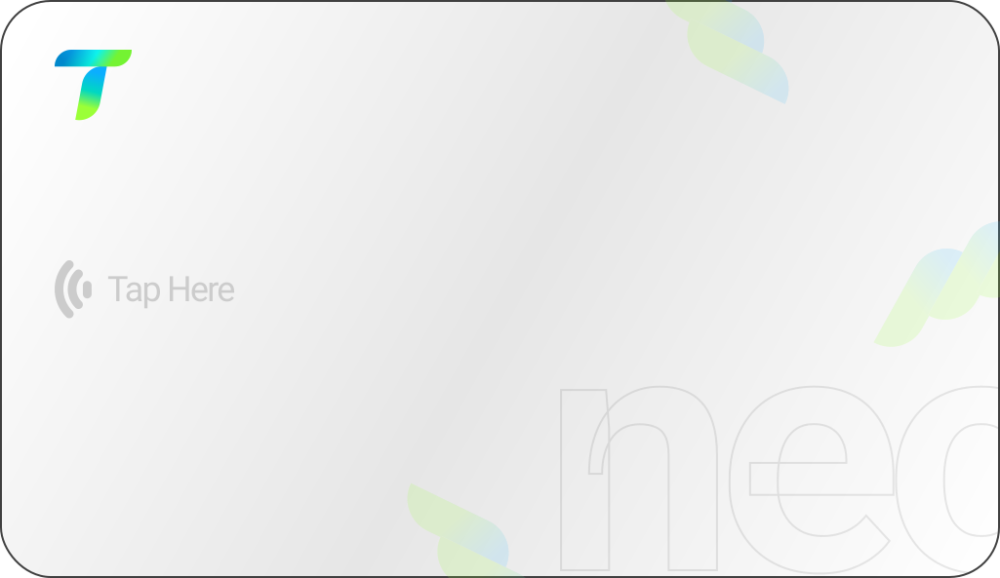
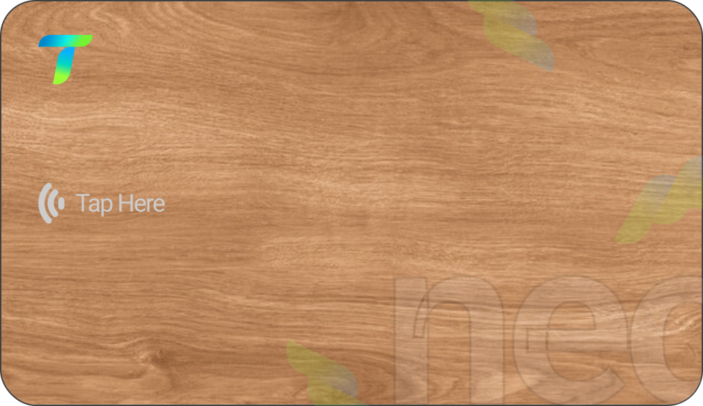
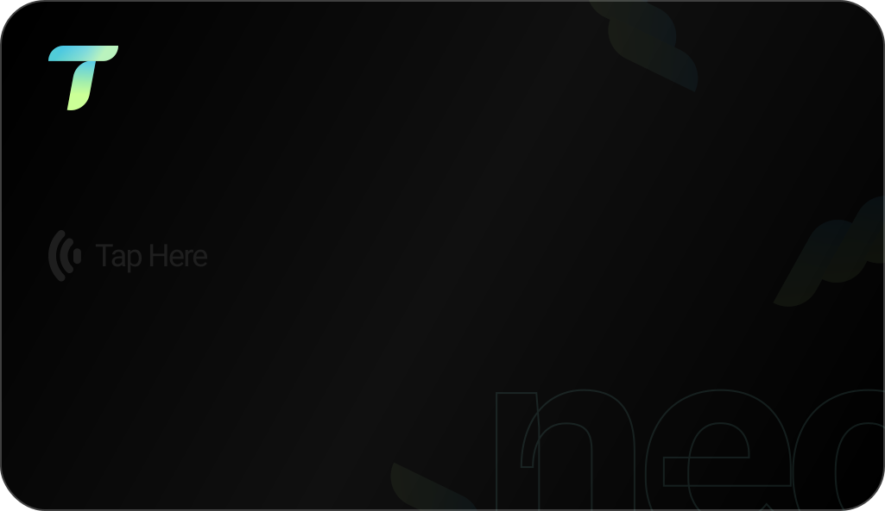

<p align="center">
  
</p>

<h1 align="center">NEO ID</h1>

<p align="center">
  NFC-enabled smart business cards for the modern professional.
  <br />
  Tap. Share. Connect.
</p>

<p align="center">
  
  
  
</p>

---

## Overview

NEO ID is a SaaS platform for creating digital business profiles linked to physical NFC cards and QR codes. Designed for the Saudi Arabia market, it supports individual professionals and company accounts with employee management, card template customization, and physical card ordering.

## Tech Stack

| Layer | Technology |
|-------|-----------|
| **Framework** | Next.js 16, App Router, React 19, TypeScript |
| **Styling** | Tailwind CSS v4, shadcn/ui, Radix UI |
| **Database** | PostgreSQL, Prisma ORM |
| **Auth** | Kinde |
| **Payments** | PayPal (subscriptions + one-time orders) |
| **File Uploads** | UploadThing |
| **Validation** | Zod v4 |
| **Animation** | Motion (Framer Motion) |

## Architecture

```
app/
  (auth)/             Sign-in / sign-up
  (dashboard)/        Authenticated pages (dashboard, profiles, company, settings, orders)
  (public)/           Public profile pages (/p/[slug])
  onboarding/         Post-signup onboarding flow
  invite/             Company invite acceptance
  api/
    auth/             Kinde auth handler
    paypal/           Payment + subscription endpoints
    uploadthing/      File upload endpoint
    profiles/         QR code + vCard generation

actions/              Server actions (profile, company, invite, subscription, card-request)
components/
  ui/                 shadcn/ui primitives
  layout/             Shell, navbar, sidebar
  neo-card/           Card showcase + preview
  profile/            Profile form + display
  company/            Company management
  settings/           Plan & billing UI
  order/              Card ordering wizard
  templates/          Template browser
  shared/             Reusable components

lib/
  auth.ts             Auth helpers (requireOnboarded, ensureUser)
  db.ts               Prisma client singleton
  paypal.ts           PayPal client config
  pricing.ts          Plans, card prices, shipping, VAT
  plan-limits.ts      Seat / profile limit checks
  validators/         Zod schemas

prisma/
  schema.prisma       Data model
  seed.ts             Seed plans, materials, templates
```

## Data Model

```
User ──── Profile ──── Card
  │           │
  │           └── CardRequest (company flow)
  │
  ├── Plan (individual: Free / Pro)
  │
  └── Company ──── Plan (Startup / Business / Enterprise)
        │
        ├── Employee[] (User)
        ├── Invite[]
        └── Template[] (custom)
```

**Two account types:** Individual (personal) and Company (with employees + seat-based plans).

**Profiles = NEO IDs.** Each profile gets a unique slug for its public URL (`/p/[slug]`), a QR code, and can have physical NFC cards attached.

**Card materials:** Classic (PVC), Artisan (Wood), Prestige (Metal). Each template has per-material design variants.

## Getting Started

```bash
# Install dependencies
npm install

# Set up environment variables
cp .env.example .env

# Push schema to database + seed
npm run prisma:update
npm run db:seed

# Start dev server
npm run dev
```

## Scripts

```bash
npm run dev            # Start dev server
npm run build          # Production build
npm run lint           # ESLint
npm run db:generate    # Regenerate Prisma client
npm run db:migrate     # Create migration files
npm run db:seed        # Seed database
npm run db:reset       # Reset DB + re-seed
npm run db:studio      # Prisma Studio GUI
```

## Environment Variables

| Variable | Purpose |
|----------|---------|
| `DATABASE_URL` | PostgreSQL connection string |
| `KINDE_*` | Kinde auth config |
| `PAYPAL_MODE` | `sandbox` or `live` |
| `PAYPAL_SANDBOX_CLIENT_ID` | PayPal sandbox credentials |
| `PAYPAL_SANDBOX_CLIENT_SECRET` | PayPal sandbox credentials |
| `PAYPAL_LIVE_CLIENT_ID` | PayPal production credentials |
| `PAYPAL_LIVE_CLIENT_SECRET` | PayPal production credentials |
| `PAYPAL_PRODUCT_ID` | PayPal catalog product for subscriptions |
| `PAYPAL_WEBHOOK_ID` | PayPal webhook signature verification |
| `NEXT_PUBLIC_APP_URL` | App base URL for redirects |
| `UPLOADTHING_TOKEN` | UploadThing API token |

---

<p align="center">
  
  <br />
  <sub>Built by <a href="https://taqneo.com">Taqneo</a></sub>
</p>
